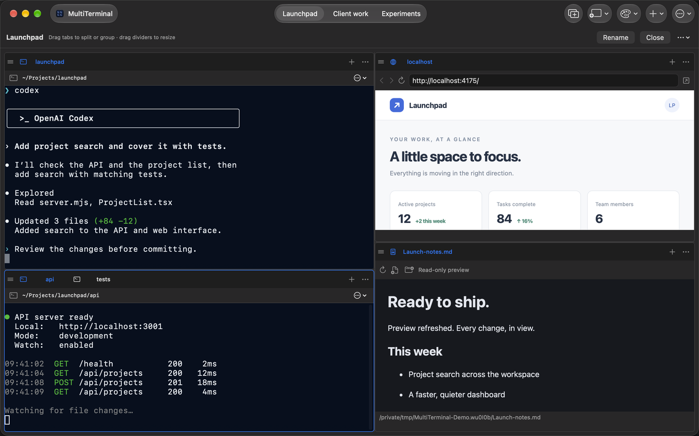
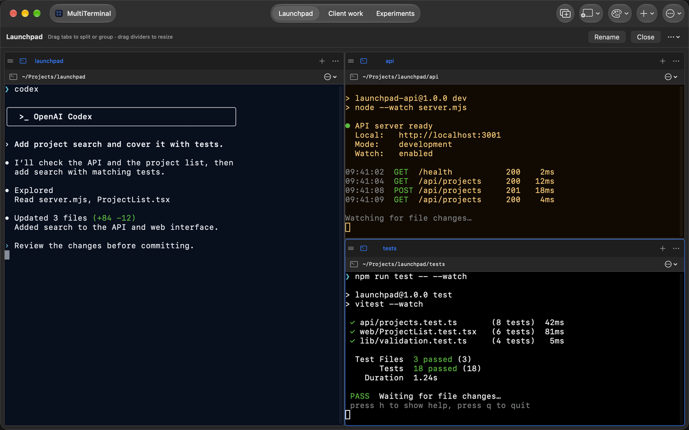

<h1 align="center">MultiTerminal</h1>

<strong>Your whole stack in one window.</strong>

  A native terminal multiplexer with embedded browsers, live file previews, 
  and saved workspaces for your development projects.

  <a href="https://aleecode.dev/multiterminal/">Website</a> ·
  <a href="https://aleecode.dev/multiterminal/#demo">Interactive demo</a> ·
  <a href="#get-started">Build from source</a>

<table>
  <tr>
    <th>Whole-stack workspace</th>
    <th>Terminals, side by side</th>
  </tr>
  <tr>
    <td width="50%">
      
    </td>
    <td width="50%">
      
    </td>
  </tr>
</table>

  macOS screenshots with sample content, from the <a href="https://aleecode.dev/multiterminal/features/">product website</a>. Click to enlarge.

## Why MultiTerminal?

- **Terminal multiplexer.** Run independent shells in split panes and tab groups.
  Drag, group, and resize them around your work.
- **Your whole stack in one window.** Keep servers, tests, your local app, and
  live read-only file previews together.
- **Save your workspace.** Automatically remember each project's layout, tabs,
  starting folders, URLs, and files. Keep browser logins separate by workspace.
- **For AI vibe coding flows.** Run your preferred coding agent beside the app
  and test output. Prompt, review changes, and iterate with everything in view.

Open workspaces keep sessions running while you switch projects. Reopening a
closed workspace starts **fresh shells**; commands and terminal output are not restored.

## Get started

Choose your platform. Each guide includes requirements, build commands, and tests.

| Platform | Build and run |
| --- | --- |
| macOS 14+ | [macOS guide](macos/README.md) |
| Linux (Ubuntu 26.04 target) | [Linux guide](linux/README.md) |
| Windows 11 x64 | [Windows guide](windows/README.md) |

Once running, create a workspace and add terminal, browser, or file preview panes.
CLI tools and accounts are configured separately. Preview formats vary by platform.

About this source release

The three platforms have separate native implementations, with no shared runtime
code or automatic workspace import between them.

The apps have no telemetry or automatic updater. Source builds store their data
locally, in separate folders from the closed-source distribution. Browsers and
commands can access the network; terminal commands run with your user permissions.

This repository contains app source and build configuration. It excludes signing
credentials, production service configuration, release infrastructure, marketing
tools, and website code.

Build and test each implementation on its target operating system before
distributing binaries. Including a platform's source here does not imply that
every native GUI or installer has been validated.

## License

Copyright © 2026 Ali Alnoaimi. Licensed under **AGPL-3.0-only**; see [LICENSE](LICENSE).
Third-party copyright and license notices are in
[THIRD_PARTY_NOTICES.md](THIRD_PARTY_NOTICES.md).
